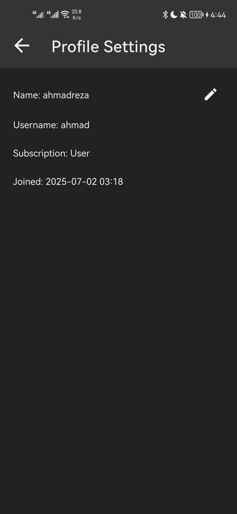

# JWT Authentication Android Ktor App

A demo project showcasing JWT-based authentication with a Kotlin backend server and a Java Android app, connected to a MongoDB database for secure user data storage with salted password hashing.

## Overview
This repository contains a full-stack authentication system demonstrating secure user management. The backend is built with **Kotlin** using Ktor, and the frontend is an **Android app** developed in **Java**. User data is stored in **MongoDB**, with passwords securely hashed using salting. The app implements JWT (JSON Web Token) for authentication and includes features like user signup, sign-in, profile updates, and ban checks.

## Features
- **Sign Up and Sign In**: Users can create accounts and log in using a username and password.
- **Automatic Auth Check**: Authentication is verified every time the app is opened.
- **JWT Token Expiry**: Tokens are valid for 1 year.
- **Ban Check**: Banned users are restricted from accessing the main app screen.
- **Profile Management**: Users can update their name via the profile screen.
- **Main Screen**: Displays a list of all registered users.
- **Secure Storage**: Passwords are hashed with salt for enhanced security.

## Tech Stack
- **Backend**: Kotlin, Ktor
- **Frontend**: Android (Java)
- **Database**: MongoDB
- **Authentication**: JWT (JSON Web Token)
- **Security**: Password hashing with salt

## Project Structure
```
JWT_Authentication_Android_Demo_App/
├── backend/                # Kotlin backend server
│   └── ...
├── android/                # Java Android app
│   └── ...
├── README.md               # Project documentation
└── ...
```

## Getting Started
### Installation
#### Backend Setup
1. **Create a MongoDB Account**:
   - Sign up for a MongoDB account (e.g., via MongoDB Atlas).
   - Obtain your connection string, MongoDB username, and password.

2. **Configure MongoDB Connection**:
   - Open `backend/src/main/kotlin/Application.kt`.
   - Update the `dbName` variable with your MongoDB database name (e.g., `auth_demo`).
   - Update the `mongoUsername` variable with your MongoDB username.
   - Verify that the MongoDB connection string in `Application.kt` is correct (e.g., `mongodb+srv://<username>:<password>@<cluster>.mongodb.net/`).

3. **Set Environment Variables**:
   - Add the following environment variables to your system or project configuration:
     - `MONGO_PASSWORD`: Your MongoDB password.
     - `JWT_SECRET`: A secure secret key for JWT token generation.

4. **Build and Run the Backend.**

#### Android Setup
1. **Configure the Android App**:
   - Open the `android/` directory in Android Studio.
   - Edit `app/src/main/res/values/strings.xml`:
     - Update the `url` field to point to your backend server.
     - Optionally, update the `supportEmail` field if you want to specify a custom support email address.

2. **Build and Run the App**:
   - Build and run the app on an emulator or physical device via Android Studio.


### Usage
1. Launch the backend server.
2. Open the Android app.
3. Sign up with a username and password.
4. Log in to access the main screen, which displays a list of users.
5. Update your name in the profile screen.
6. Test ban functionality by updating user status in MongoDB.

## Documentation
### API Endpoints
| Endpoint | Method | Description | Request Body | Header | Response |
|----------|--------|-------------|--------------|--------|----------|
| `/signup` | POST | Register a new user | `{ "username": "", "password": "" }` | None | None |
| `/signin` | POST | Authenticate a user | `{ "username": "", "password": "" }` | None | `{ "token": "" }` |
| `/authenticate` | POST | Check auth token |`{ "appVersion": "", "device": "" }` | `Authorization` -> `Bearer token` | None & 403 If user is banned |
| `/users` | GET | List all users | None | `Authorization` -> `Bearer token` | `[{"id": "65..74","subscription": 0,"username": "user1","name": "name","created": 1..11,"lastLogin": 1..26},{...}]` |
| `/userinfo` | GET | Get your user data | None | `Authorization` -> `Bearer token` | `{"id": "62...24","username": "user1","subscription": 0,"name": "yourname","created": 17..01}` |
| `/name` | PATCH | Update name | `{ "name": "" }` | `Authorization` -> `Bearer token` | None |

### Database Schema
| Collection | Fields | Description |
|------------|--------|-------------|
| `Users` | `_id`, `username`, `password`,`salt`,`name`, `banStatus`,`subscription`,`device`,  `appVersion` , `loginCount`, `created`, `lastLogin`| Stores user data with hashed passwords and ban status |

## Security Notes
- Passwords are hashed with a salt for secure storage.
- Ensure MongoDB is secured with proper access controls.

## Screenshots
|  |  |  |
|-----------------------------------------|-----------------------------------------|-----------------------------------------|
|  |  |  |

## Contributing
Contributions are welcome! Please follow these steps:
1. Fork the repository.
2. Create a new branch.
3. Commit your changes.
4. Push to the branch.
5. Open a Pull Request.

## License
This project is licensed under the MIT License. See the [LICENSE](LICENSE) file for details.

## Contact
For questions or feedback, feel free to reach out via GitHub Issues or contact me at `ahmadrezagh671@gmail.com`.
